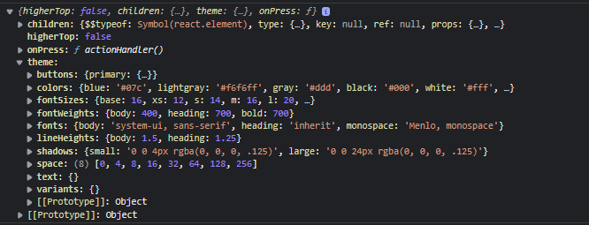
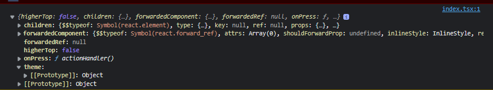

Branches are _main_ and _styled-components_, main is the _emotion_ version.

install dependencies:

```
yarn install
```

run storybook:

```
yarn storybook
```

It will open a browser window with storybook.
Open developer tools and check the console logs. In main branch you should see:


change to styled-components branch
run yarn to install styled-components
and re-run storybook.
check this time the logs:

